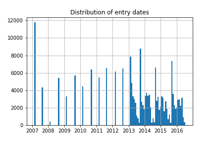
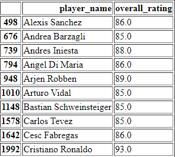
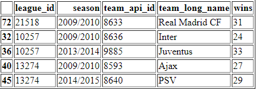

# Project of Data Visualization (COM-480)

| Student's name | SCIPER |
| -------------- | ------ |
| Alexandre Cadillon| 288684|
|Abed Alrahman Shabaan | 237731|
| Sabaa Karim | 269647 |

[Milestone 1](#milestone-1) • [Milestone 2](#milestone-2) • [Milestone 3](#milestone-3)

## Milestone 1 (23rd April, 5pm)

**10% of the final grade**

This is a preliminary milestone to let you set up goals for your final project and assess the feasibility of your ideas.
Please, fill the following sections about your project.

*(max. 2000 characters per section)*

### Dataset

> Find a dataset (or multiple) that you will explore. Assess the quality of the data it contains and how much preprocessing / data-cleaning it will require before tackling visualization. We recommend using a standard dataset as this course is not about scraping nor data processing.
>
> Hint: some good pointers for finding quality publicly available datasets ([Google dataset search](https://datasetsearch.research.google.com/), [Kaggle](https://www.kaggle.com/datasets), [OpenSwissData](https://opendata.swiss/en/), [SNAP](https://snap.stanford.edu/data/) and [FiveThirtyEight](https://data.fivethirtyeight.com/)), you could use also the DataSets proposed by the ENAC (see the Announcements section on Zulip).

### Problematic

Our inspiration comes from the [Too-Much-Talent Effect](https://journals.sagepub.com/doi/10.1177/0956797614537280), a study published in Psychological Science Journal. Whether we're trying to build a sports team or a team of engineers, most people will choose talent as their top criteria in recruting. But does grouping together individuals only on the basis of talent guarantee the best possible performance ? That's what the study was about, they looked into the relationship betweet team member's individual talents and team performance. They studied around 400 football matches from the 2010 and 2014 world cup. Surveys have shown that 37% of people believe that it's a linear relationship, the more stars in a team there is, the more successful it becomes. The result of the study have shown that individual talent helps the team's performance but only up to a certain point then it starts having a negative effect. We would like to induct this study topic on our dataset and to produce an interactive visualization for people who are unaware of this effect and for the 37% percent who don't believe it.

### Exploratory Data Analysis

Preprocessing of the player data shows that we have a total of 11060 players in the dataset, for each of them we have multiple `attributes` entries, those come from the FIFA video game data. We will use the overall score from that table as the rating of each player.
We have one entry per player per season for the first years, but then we start to have multiple entries per player, which means we will have to average those.

Taking for example the very last year in the dataset (2016) we get the following top 10 list

Doing a preprocessing of the league, team, and match data, we are able to infer how many matches each team won, and so we can guess the winner of each league each season as the winner of most matches, this guess checks out against the ground truth.

### Related work

> - What others have already done with the data?
> - Why is your approach original?
> - What source of inspiration do you take? Visualizations that you found on other websites or magazines (might be unrelated to your data).
> - In case you are using a dataset that you have already explored in another context (ML or ADA course, semester project...), you are required to share the report of that work to outline the differences with the submission for this class.

## Milestone 2 (7th May, 5pm)

**10% of the final grade**

## Milestone 3 (4th June, 5pm)

**80% of the final grade**

## Late policy

- < 24h: 80% of the grade for the milestone
- < 48h: 70% of the grade for the milestone

